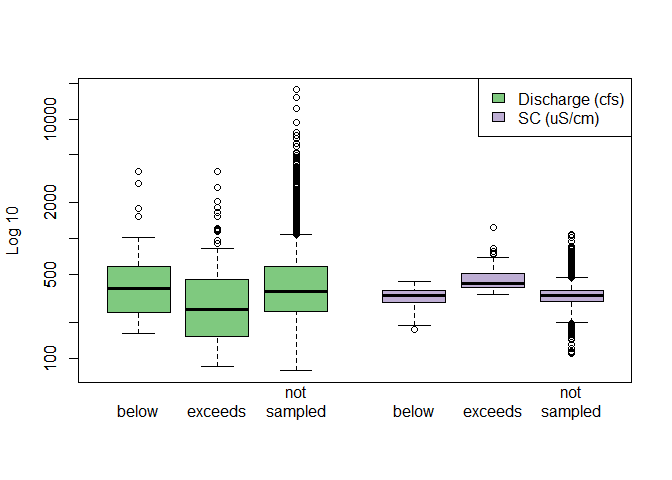

<!-- README.md is generated from README.Rmd. Please edit that file -->

# THIS README IS FOR DEMONSTRATION PURPOSES ONLY

# streamsampler

The goal of `streamsampler` is to provide the ability to perform
stratified subsampling of a water quality record of daily (or at least
very frequent) observations. The water quality record is stratified
based on a seasonal threshold of reference measurements, such as
discharge, and then subsampled for measurements occuring below and
exceeding the threshold. For observations associated with a reference
measurement below the threshold, subsampling is conducted at a specified
frequency (e.g., monthly). Observations associated with a reference
measurement exceeding the threshold are subsampled for each year of the
record. The resulting subsampled record approximates a water quality
record that would have been produced by physical data collection.

A subsampled water quality record allows a user to apply mathematical,
statistical, and/or modeling techniques to a record with less frequent
observations. For example, a user may find a 30-year record of daily
water quality observations, subsample the record, fit a WRTDS model
(from the `EGRET` package), and then compare the results to the complete
record.

The streamsampler package can also determine the completeness of a
discharge or water quality record, determine the location of gaps in the
record, and provide the number and proportion of positive and negative
values.

## Installation

You can install the current version of streamsampler like so:

**Note:** Installation of `streamsampler` is not yet available.

## Example

This is a basic example which shows you how to examine the completeness
of a record. Both the Specific Conductivity (SC) record and discharge
(q) record in this example start in October of 2007.

``` r
library(streamsampler)

sc_dates <- streamdat[!is.na(streamdat$sc), "date"]
eval_dates(
  dates = sc_dates, 
  rec_start = as.Date("2007-10-01"), 
  rec_end = as.Date("2023-09-30"), 
  by = "day"
)
#>   pct_complete n_miss
#> 1     98.68241     77
```

You can also examine a record for gaps. In this example, the first 6
gaps in the SC record are shown.

``` r
sc_gaps <- find_gaps(dates = sc_dates)
head(sc_gaps)
#>   n_days      start        end location
#> 1      9 2020-08-05 2020-08-13     4626
#> 2      5 2017-11-23 2017-11-27     3658
#> 3      4 2017-12-08 2017-12-11     3668
#> 4      3 2008-10-11 2008-10-13      377
#> 5      3 2019-07-22 2019-07-24     4255
#> 6      2 2012-07-31 2012-08-01     1746
```

With a few lines of code, the any gap can be viewed in the parent
record.

``` r
gap_start <- which(
  streamdat$date == find_gaps(dates = sc_dates)[1, "start"]
)
gap_end <- which(
  streamdat$date == find_gaps(dates = sc_dates)[1, "end"]
)
streamdat[(gap_start - 1):(gap_end + 1), ]
#>            date    q  sc
#> 4692 2020-08-04 4010 216
#> 4693 2020-08-05 6920  NA
#> 4694 2020-08-06  813  NA
#> 4695 2020-08-07 1840  NA
#> 4696 2020-08-08 2020  NA
#> 4697 2020-08-09  765  NA
#> 4698 2020-08-10  654  NA
#> 4699 2020-08-11  547  NA
#> 4700 2020-08-12  616  NA
#> 4701 2020-08-13  736  NA
#> 4702 2020-08-14  490 276
```

There are several other useful functions offered by `streamsampler`, but
the main function is `subsample()`. This function will perform
stratified subsampling to produce a smaller, representative data set a
daily water quality record.

``` r
ss_sc <- subsample(
  dates = streamdat$date, 
  values = streamdat$sc, 
  thresh_ref = streamdat$q
)

not_sampled <- ss_sc[ss_sc$sample_type == "not_sampled", ]
blw_thresh <- ss_sc[ss_sc$sample_type == "below_threshold", ]
excd_thresh <- ss_sc[ss_sc$sample_type == "exceeds_threshold", ]

# Sampling across dates
plot(
  not_sampled$date, not_sampled$thresh_ref, 
  col = "gray", log = "y"
)
points(
  blw_thresh$date, blw_thresh$thresh_ref, 
  col = "blue", pch = 16
)
points(
  excd_thresh$date, excd_thresh$thresh_ref, 
  col = "purple", pch = 16
)
legend("topleft", 
  c("not_sampled", "below_threshold", "exceeds_threshold"), 
  fill = c("gray", "blue", "purple")
)
```


``` r

# Sampling across the threshold reference
plot(
  not_sampled$thresh_ref, not_sampled$value, 
  log = "x", ylim = c(0, max(ss_sc$value, na.rm = TRUE)), 
  xlim = c(50, 20000), col = "gray"
)
points(
  blw_thresh$thresh_ref, blw_thresh$value, 
  col = "blue", pch = 16
)
points(
  excd_thresh$thresh_ref, excd_thresh$value, 
  col = "purple", pch = 16
)
legend("topleft", 
  c("not_sampled", "below_threshold", "exceeds_threshold"), 
  fill = c("gray", "blue", "purple")
)
```


``` r

# Compare spread
ss_sc$q_lab <- "Discharge"
ss_sc$sc_lab <- "SC"
boxplot(
  thresh_ref ~ sample_type + q_lab, data = ss_sc, 
  at = 1:3, 
  xlim = c(0.5, 7.0),
  log = "y",
  col = "#7fc97f", ylab = "Log 10", xlab = "", xaxt = "n"
)
boxplot(
  value ~ sample_type + sc_lab, data = ss_sc, 
  add = TRUE, at = 5:7 - 0.5, xaxt = "n", 
  col = "#beaed4"
)
axis(
  1, at = c(1:3, 5:7 - 0.5), 
  labels = rep(c("below", "exceeds", "not\nsampled"), 2), 
  lwd = 0
)
legend(
  "topright", 
  c("Discharge (cfs)", "SC (uS/cm)"), 
  fill = c("#7fc97f", "#beaed4")
)
```


The default is to subsample for 1 observation that is below the
threshold for each month, and 8 observations that are above the
threshold for each year, where the threshold is the 80th percentile of
each season (4 seasons starting in October).

There are several ways to change the subsampling procedure. In the
example below, SC will be used as the threshold reference (versus
discharge); peaks, based on a 30-day sliding window, will be targeted
for observations exceeding the 90th percentile; the year will be set to
start in January with 3 seasons; and 1 observation below the threshold
per quarter and 10 observations exceeding the threshold per year will be
selected.

``` r
ss_peaks <- subsample(
  dates = streamdat$date, 
  values = streamdat$sc, n_samples = 1, freq = "quarter", 
  thresh_ref = streamdat$sc, threshold = 0.9, n_et_samples = 10, 
  look_behind = 29, look_units = "days", 
  season_start = 1, n_seasons = 3
)

ss_streamdat <- merge(streamdat, ss_peaks[, c("date", "sample_type")])
not_sampled <- ss_streamdat[ss_streamdat$sample_type == "not_sampled", ]
blw_thresh <- ss_streamdat[ss_streamdat$sample_type == "below_threshold", ]
excd_thresh <- ss_streamdat[ss_streamdat$sample_type == "exceeds_threshold", ]


# Sampling across dates
plot(
  not_sampled$date, not_sampled$sc, 
  col = "gray", log = "y"
)
points(
  blw_thresh$date, blw_thresh$sc, 
  col = "blue", pch = 16
)
points(
  excd_thresh$date, excd_thresh$sc, 
  col = "purple", pch = 16
)
legend("topleft", 
  c("not_sampled", "below_threshold", "exceeds_threshold"), 
  fill = c("gray", "blue", "purple")
)
```


``` r

# Sampling across the threshold reference
plot(
  not_sampled$q, not_sampled$sc, col = "gray", 
  log = "x", ylim = c(0, max(ss_sc$value, na.rm = TRUE))
)
points(
  blw_thresh$q, blw_thresh$sc, 
  col = "blue", pch = 16
)
points(
  excd_thresh$q, excd_thresh$sc, 
  col = "purple", pch = 16
)
legend("topleft", 
  c("not_sampled", "below_threshold", "exceeds_threshold"), 
  fill = c("gray", "blue", "purple")
)
```


Changing the threshold reference, number of seasons, and the season
start month alters how the data set is stratified.

``` r
# Compare spread
ss_streamdat$q_lab <- "Discharge"
ss_streamdat$sc_lab <- "SC"
boxplot(
  q ~ sample_type + q_lab, data = ss_streamdat, 
  # at = 1:3 - 0.2, 
  at = 1:3, 
  # boxwex = 0.25, 
  xlim = c(0.5, 7.0),
  log = "y",
  col = "#7fc97f", ylab = "Log 10", xlab = "", xaxt = "n"
  # names = c("below", "exceeds", "not\nsampled")
)
boxplot(
  sc ~ sample_type + sc_lab, data = ss_streamdat, 
  add = TRUE, at = 5:7 - 0.5, xaxt = "n", 
  col = "#beaed4"
  # names = c("below", "exceeds", "not\nsampled")
)
axis(
  1, at = c(1:3, 5:7 - 0.5), 
  labels = rep(c("below", "exceeds", "not\nsampled"), 2), 
  lwd = 0
)
legend(
  "topright", 
  c("Discharge (cfs)", "SC (uS/cm)"), 
  fill = c("#7fc97f", "#beaed4")
)
```


